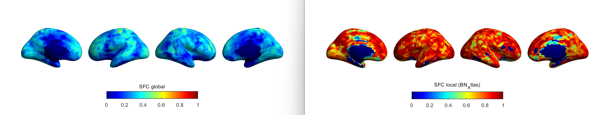

# SBCI_Toolkit for SBCI Result Visualization

The SBCI Toolkit is designed for visualization and analysis of structural and functional brain connectivity (SC/FC) data outputed from the [SBCI Pipeline.](https://github.com/sbci-brain/SBCI_Pipeline). The primary functions within this toolkit allow users to plot continuous SC/FC data, adjust resolution, compute Surface-Based Connectivity Integration (SFCI), and display various metrics on the cortical surface.

## Installation

1. Toolkit written by Matlab code.
2. To use it, just clone or download the repo to your local machine.
3. Run the `main.m` script using Matlab.

## Required Data

This toolkit designed for visualizing and analyzing outputs generated by the SBCI pipeline. One example of the SBCI output can be found in `example_data/SBCI_Individual_Subject_Outcome`. If you use the SBCI Pipeline, you will find the connectome data in the following path:  `Data_Path/Subject_ID/psc_sbci_final_files/sbci_connectome`.

## Important Parameters

### `sbci_parc` Parameter

The `sbci_parc` parameter is an array of structures, with each structure representing a different brain parcellation. Current SBCI Toolkit supports the following brain parcellations:

| Index | Parcellation Name                        |
| ----- | ---------------------------------------- |
| 1     | BN_Atlas                                 |
| 2     | HCPMMP1                                  |
| 3     | PALS_B12_Brodmann                        |
| 4     | PALS_B12_Lobes                           |
| 5     | PALS_B12_OrbitoFrontal                   |
| 6     | PALS_B12_Visuotopic                      |
| 7     | Schaefer2018_1000Parcels_7Networks_order |
| 8     | Schaefer2018_100Parcels_7Networks_order  |
| 9     | Schaefer2018_200Parcels_7Networks_order  |
| 10    | Schaefer2018_300Parcels_7Networks_order  |
| 11    | Schaefer2018_400Parcels_7Networks_order  |
| 12    | Schaefer2018_500Parcels_7Networks_order  |
| 13    | Schaefer2018_600Parcels_7Networks_order  |
| 14    | Schaefer2018_700Parcels_7Networks_order  |
| 15    | Schaefer2018_800Parcels_7Networks_order  |
| 16    | Schaefer2018_900Parcels_7Networks_order  |
| 17    | Yeo2011_17Networks_N1000                 |
| 18    | Yeo2011_7Networks_N1000                  |
| 19    | aparc.a2005s                             |
| 20    | aparc.a2009s                             |
| 21    | aparc                                    |
| 22    | oasis.chubs                              |

To discover available parcellation names, execute the following command:

```matlab
disp(strjoin(cellfun(@(c) c{1}, {sbci_parc.atlas}, 'UniformOutput', false), ', '));
```

To select a specific atlas for analysis, modify the `sbci_parc` argument accordingly. For example, to choose the first atlas in the array, use:

```matlab
atlas_index = 1; % BN_Atlas in example; 
```

### `roi_exclusion` Parameter

The `roi_exclusion` parameter enables exclusion of specified regions from the matrix plot, enhancing focus on areas of interest. To apply this mask, specify the regions to exclude as follows:

```matlab
roi_exclusion_index = [1, 36]; % this will remove regions 1 and 36
```

## Usage

The main functionality of the SBCI Toolkit is encapsulated in the `main.m` script. Example data are in the `sbci_connectome` folder. The `main.m` can do the following visualization and connectivity data analysis:

### **Display Continuous SC/FC Data**

Displays high-resolution structural and functional connectivity (SC/FC) data. This function takes structural and functional connectivity matrices as input along with a parcellation object and visualizes the connectivity patterns.

```
plot_connectivity(fc, sc, sbci_parc, atlas_num, roi_mask_num);
```


### **Convert Continuous SC/FC to Discrete ROI based SC/FC**

SBCI allows for the quick switching between the continuous connectivity to Atlas-level discrete connectivity using the `parcellate_fc` and `parcellate_sc` functions. This means that it is possible to perform conventional analysis with any number of atlases, without the need to rerprocess data.

```
adjust_connectivity_res(fc, sc, sbci_parc, atlas_index, sbci_mapping, roi_mask_num);
```


### **Compute and Display SFC on the Cortical Surface**

Computes and visualizes local and global structural and functional Coupling (SFC) directly on the cortical surface. This function integrates connectivity data with surface mapping and parcellation information to provide a comprehensive view of connectivity patterns across the cortex.

```
sfc_gbl = calculate_sfc_gbl(sc, fc, 'triangular', true);
sfc_loc = calculate_sfc_loc(sc, fc, sbci_parc(atlas_index), 'triangular', true);
```

```
plot_cortical_sfc(sfc_gbl, sfc_loc, sbci_surf, sbci_mapping, sbci_parc, atlas_index);
```



### **Display Scalar Value on the SBCI Cortical Surface**

Allows for the visualization of scalar value (e.g., genetic heritability, cortical thickness) on the SBCI cortical surface. This function takes surface mapping, parcellation information, and a file containing the values to be displayed, offering a versatile approach to visualizing diverse data types on the brain surface.

```
plot_value_cortically(sbci_surf, sbci_mapping, 'ave_heritability.txt');
```

sss
